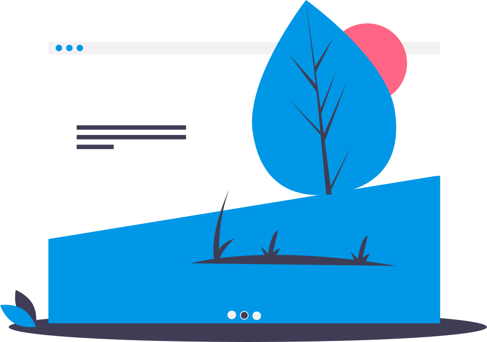

<section style="float: left; width: 100%; display: flex; background: #fff; color: #333;">
    
    

        <h1>Hi, I'm Ollie 👋💻</h1>
        

            
            
        

        <h3>A passionate web developer in the UK</h3>
        
I'm primarily a web developer, whether it's learning new technologies/techniques for building and maintaining websites, learning a depper understanding of infrastucture management or building small projects to expand my knowledge in GoLang or Python.

    

</section>

<section style="float: left; width: 100%; display: flex; flex-flow: row; justify-content: space-between; background: #fff; color: #333; text-align: center;">
    

        <h3 style="text-align: left;">The main technologies I use:</h3>
        

            

                <h4>Front-end</h4>
                

                    

HTML5

                    

CSS

                    

JS

                

            

            

                <h4>Back-end</h4>
                

                    

PHP

                    

GoLang

                    

Python

                    

MySQL

                

            

            

                <h4>Infrastructure</h4>
                

                    

docker

                    

vagrant

                    

Linux

                    

bash

                    

NGINX

                

            

            

                <h4>Other Tools</h4>
                

                    

git

                    

Photoshop

                    

Electron

                

            

        

    

    
</section>